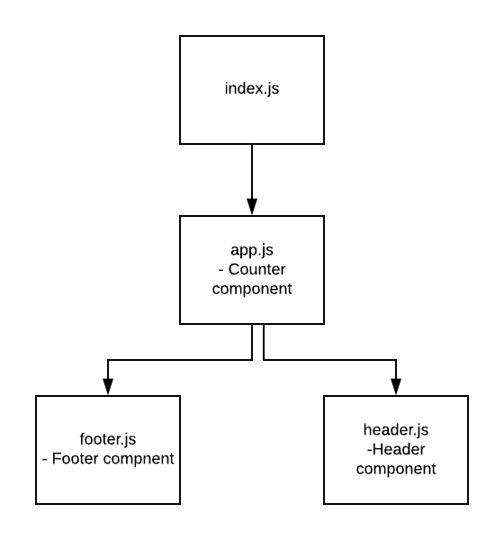

# LAB - 18

 ## ACL

 ### Author: Evan Brecht-Curry

 ### Links and Resources
* [deployment](https://codesandbox.io/embed/starter-code-09t9j) 

 ##### Exported Values and Methods
* `Main component renders App`
* `Counter component: Handles increment up, increment down and renders footer header buttons`
* `Header component renders header`
* `Footer component renders footer`

### Setup

#### `.env` requirements

 #### UML
